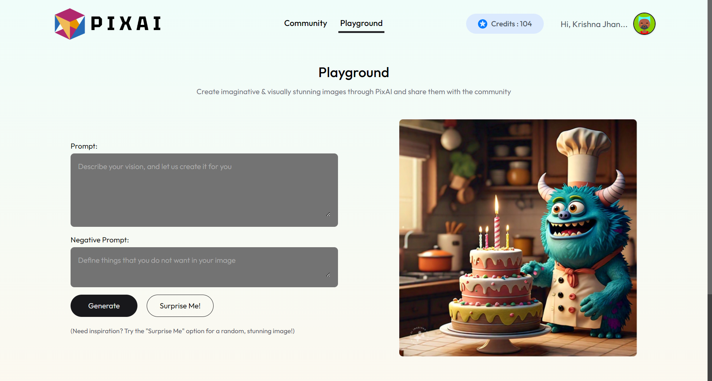

# PixAI Website
PixAI is a full stack website project that provides an intuitive and streamlined platform for users to explore, manage, and enhance their visual creativity through AI-powered image generation. This platform caters to photographers, designers, and creative enthusiasts.

## 🚀 Live Application
https://pixai-image-generation.onrender.com/

<div style="display: flex; align-items: center; justify-content: space-evenly; flex-wrap: wrap; gap: 1rem">
    
    
    
    
</div>

## 🎯 Features
- **AI-Powered Image Generation:** Generate images using advanced AI algorithms with support for both prompts and negative prompts.

- **NSFW Detection:** NSFW detection using Perspective API for text prompts and an additional API to verify generated images, ensuring double-check safety.

- **User Authentication:** Secure user authentication, verification and authorization using JWTs.

- **Email Functionality:** Using Nodemailer to send verification OTPs, welcome emails, password recovery, and password reset confirmations.

- **Razorpay Integration:** Seamless integration with Razorpay for secure and efficient payment processing *(Using in test mode currently)*.

- **Full CRUD Implementation:** Complete CRUD functionality for users to create, read, update, and delete their images.

- **Animations:** Used motion.dev (previously known as framer-motion) to add minimalistic transiitons and animations

- **Responsive Design:**  Fully optimized for desktop and mobile devices.

## 🛠️ Tech Stack
- **Frontend:** React.js, HTML5, CSS3, Tailwind CSS
- **Backend:** Node.js, Express.js
- **Database:** MongoDB Atlas
- **APIs:** RESTful API design, Cloudinary, Nodemailer, Brevo SMTP, Rapid API, Razorpay, Perspective API
- **Hosting:** Render

*Rapid API (https://rapidapi.com/) - using two API's from here:*
1. ImageAI-Generator
2. NSFW images detection and classification

## 📂 Project Structure
The project is divided into two main parts: the client (frontend) and the server (backend).

## ⚙️ Setup and Installation
Clone the repository & enter the PixAI directory.
```bash
git clone https://github.com/krishnaj01/PixAI.git
cd PixAI
```
### Client Setup
1. Install dependencies:
```bash
cd client
npm install
```

2. Set up environment variables:
*(Create a .env file in the client directory and add the following)*

```
VITE_BACKEND_URL='http://localhost:3000'

VITE_RAZORPAY_KEY_ID=<your-razorpay-test-mode-key-id>
```

3. Start the development server:
```bash
npm run dev
```

### Server Setup
1. Install dependencies:
```bash
cd server
npm install
```

2. Set up environment variables:
*(Create a .env file in the server directory and add the following)*

```
DB_URL=<your-mongodb-connection-string>
SIGNED_COOKIE_SECRET=<your-signed-cookie-secret>
JWT_SECRET=<your-jwt-secret>
FRONTEND_URL='http://localhost:5173'

CLOUDINARY_CLOUD_NAME=<your-cloudinary-cloud-name>
CLOUDINARY_KEY=<your-cloudinary-key>
CLOUDINARY_SECRET=<your-cloudinary-secret>

SMTP_USER=<your-smtp-user>
SMTP_PASSWORD=<your-smtp-password>
SMTP_SENDER_EMAIL=<your-smtp-sender-email>

X_RAPID_API_KEY=<your-x-rapid-api-key>

GOOGLE_API_KEY_PERSPECTIVE_API=<your-google-api-key-perspective-api>
PERSPECTIVE_API_URL='https://commentanalyzer.googleapis.com/v1alpha1/comments:analyze'

RAZORPAY_KEY_ID=<your-razorpay-test-mode-key-id>
RAZORPAY_KEY_SECRET=<your-razorpay-test-mode-key-secret>
CURRENCY='INR'
```

3. Start the backend server:
```bash
npm run server
```

## 📝 Contribution Guidelines
To contribute:
1. Fork the repository.
2. Create a new branch for your feature/bug fix.
3. Commit your changes with meaningful commit messages.
4. Push to your fork and submit a pull request.

## 📬 Contact
For any issues or suggestions, contact me at krishnaj@iitbhilai.ac.in